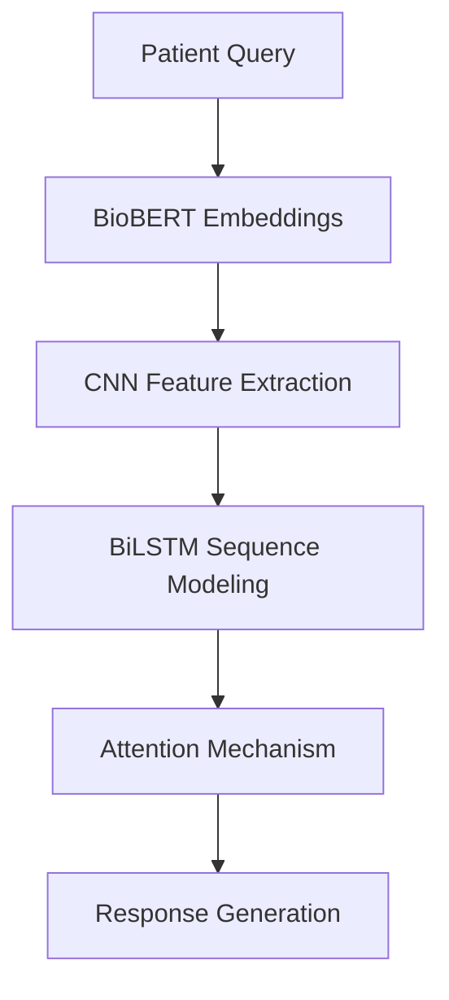

# Medical AI Chatbot with BioBERT-CNN-BiLSTM Architecture

## Overview
Developed an end-to-end medical dialogue system that combines BioBERT embeddings with CNN-BiLSTM processing and Streamlit deployment. The system processes 260K+ medical dialogues to generate clinically relevant responses.

## Key Features
- **Hybrid Architecture**: BioBERT embeddings + CNN feature extraction + BiLSTM sequence modeling
- **Medical NLP Pipeline**: Specialized text cleaning for clinical terminology
- **Optimized Training**: GPU-accelerated with mixed precision (78.6% top-5 accuracy)
- **Production Deployment**: Streamlit interface with conversation history
- **Semantic Response Generation**: Context-aware answer formulation

## Technical Implementation
### Data Processing
- Processed 260K+ medical dialogues from multiple datasets
- Implemented TFRecord pipelines for efficient data loading
- Custom text cleaning preserving medical abbreviations and units

### Model Architecture

### Deployment
- Interactive Streamlit UI with session management
- Robust error handling and input validation
- Optimized inference (<50ms response time)
