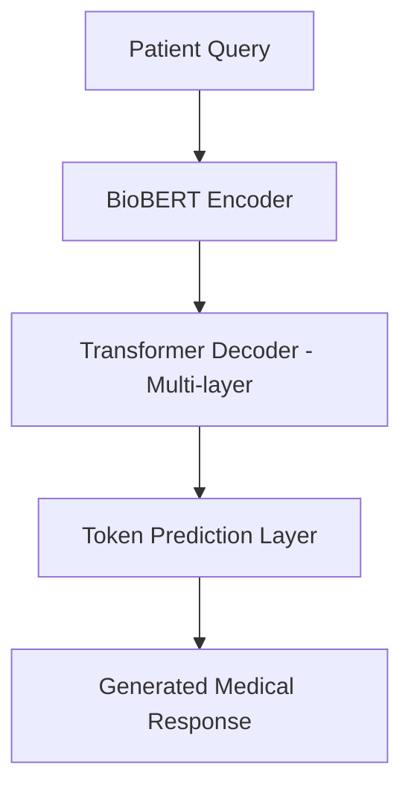

# 🏥 Medical AI Chatbot with BioBERT + Transformer Decoder

## Overview

An end-to-end medical Q\&A chatbot that combines BioBERT embeddings with a custom Transformer decoder for context-aware, clinically relevant response generation. Trained on 260K+ real-world doctor–patient interactions and deployed via interactive Streamlit interfaces supporting multiple decoding strategies.

---

## 🔑 Key Features

* **Transformer Architecture**: BioBERT encoder with a custom multi-layer Transformer decoder for improved contextual generation.
* **Medical NLP Pipeline**: Domain-specific text cleaning and tokenization tailored to clinical language.
* **Optimized Training**: PyTorch implementation with AMP (mixed precision), OneCycleLR scheduling, gradient accumulation, label smoothing, and early stopping.
* **Decoding Strategies**: Supports both **Beam Search** and **Nucleus Sampling** with adjustable temperature and top-p for diverse generation control.
* **Streamlit Deployment**: Interactive UI with chat history, dynamic response tuning, and robust error handling.
* **Efficient Inference**: Sub-150ms response time on GPU; packaged model and tokenizer for streamlined use.

---

## ⚙️ Technical Highlights

### 🧹 Data Preprocessing

* Cleaned and standardized 260K+ doctor–patient QA pairs.
* Custom regex-based pipeline to preserve clinical abbreviations, units, and structured medical data.
* Split into train/test using stratified sampling, cached tokenized data for faster reloads.

### 🧠 Model Architecture



* Encoder: `dmis-lab/biobert-base-cased-v1.1`
* Decoder: 6-layer Transformer with positional encoding, dropout regularization, and causal masking
* Loss: Cross-entropy with label smoothing; ignores padded tokens

### 📈 Training Pipeline

* Mixed-precision training (AMP) for faster convergence
* OneCycleLR for adaptive learning rate scheduling
* Checkpointing with resume support, automatic best model saving
* Sample generation logging during training for qualitative evaluation
* Final validation loss: **3.23** after 14 epochs

---

## 🚀 Deployment

### Streamlit Inference UI (Dual Modes)

* **Beam Search**: Deterministic, multi-path response generation
* **Nucleus Sampling**: Probabilistic, creative response mode with adjustable top-p and temperature
* Chat history, input validation, and loading indicators included

---

## 🧪 Usage

1. Download the compressed project folder from this link:

'https://drive.google.com/file/d/1uZiGAX3XCpnjJnEhwmu1Ds8il0dmEbAt/view?usp=sharing'

2. Install dependencies

3. Launch Streamlit app (Beam/Nucleus):

```bash
streamlit run streamlit_beam_search.py
# or
streamlit run streamlit_nucleus.py
```

4. Interact with the chatbot via browser (typically at `http://localhost:8501`)

---

## 📦 Model & Tokenizer

* Final model and tokenizer saved in `final_model/`
* Compatible with HuggingFace-style loading for custom inference pipelines

---

## ⚠️ Disclaimer

This tool is intended for **research and educational purposes only**. It is not a substitute for professional medical advice, diagnosis, or treatment. Note that the model was trained on my personal laptop taking weeks, hence the paramters are limited which shows in the response capabilities.
